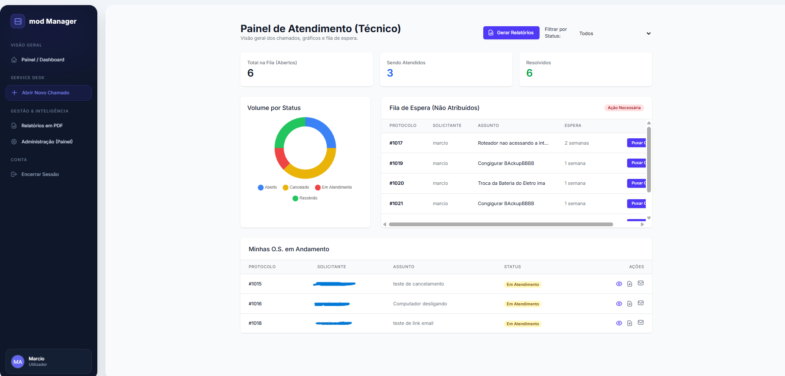

# Arquitetura ModOS PRO

---

---
---
Este documento traduz as capacidades técnicas e a arquitetura de negócio do sistema de mod Desk e Gestão de TI. O sistema foi desenhado para operar com isolamento de dados, fluxos de trabalho bem definidos e processamento em segundo plano.

## 1. Arquitetura Multi-Tenant

Nesta secção, detalhamos como o núcleo do sistema garante a segurança da informação. As permissões (QuerySets do Django) alteram dinamicamente a visibilidade dos chamados e relatórios.

### 👑 Administrador Geral (Superuser)

* **Descrição:** Possui visão global. Acede a todos os chamados, relatórios e configurações de todas as empresas registadas.
* **Mecanismo de Segurança:** Bypass de bloqueio. Sem restrições. Vê tudo.
* **Visibilidade:** Vê os dados da Empresa Alpha, Empresa Beta e Empresa Gamma.

### 🔧 Técnico Específico

* **Descrição:** Vinculado a empresas específicas através de uma relação *Many-to-Many*. O painel ajusta-se para mostrar apenas os clientes autorizados.
* **Mecanismo de Segurança:** Filtro rigoroso por IDs autorizados: `qs.filter(empresa_id__in=empresas_ids)`
* **Visibilidade:** Vê os dados apenas das empresas às quais está vinculado (ex: Empresa Alpha e Empresa Gamma), mas é bloqueado nas restantes (ex: Empresa Beta).

### 👤 Cliente / Staff Comum

* **Descrição:** Vê e interage apenas com os chamados da sua própria empresa. Impossibilitado de ver dados de outros inquilinos.
* **Mecanismo de Segurança:** Filtro Estrito para a própria empresa: `qs.filter(empresa=user.empresa)`
* **Visibilidade:** Vê APENAS a sua própria empresa. Bloqueado em todas as outras.

## 2. Gestão de Service Desk (Workflow)

O fluxo de trabalho define o ciclo de vida exato de uma Ordem de Serviço (O.S.). Abaixo exploramos as ações permitidas e as alterações automáticas de status geridas pelo sistema.

### Passo 1: Abertura 🎫

* **Status:** `ABERTO`
* **Descrição:** O processo inicia-se quando o cliente preenche o formulário de requisição. Neste momento, o sistema gera o protocolo e notifica a equipa técnica através do roteamento inteligente.
* **Ação Principal:** Preenchimento de dados do problema e vinculação do equipamento.

### Passo 2: Atribuição 👤

* **Status:** `EM_ATENDIMENTO`
* **Descrição:** Um técnico visualiza a fila de espera no painel (Não Atribuídos) e clica em "Puxar O.S.". O sistema vincula o utilizador como responsável e regista a transação.
* **Ação Principal:** Atribuição de responsabilidade no Dashboard Técnico.

### Passo 3: Interação 💬

* **Status:** `EM_ATENDIMENTO`
* **Descrição:** Sistema de comentários em tempo real para comunicação entre o técnico e o cliente. Suporta anexos e regista a hora de cada interação na página de detalhes.
* **Ação Principal:** Troca de mensagens, atualizações e envio de ficheiros/imagens.

### Passo 4: Resolução ✅

* **Status:** `RESOLVIDO`
* **Descrição:** O técnico finaliza o chamado preenchendo o Laudo Técnico. O sistema gera a data de encerramento, bloqueia novos comentários e disponibiliza o PDF final ao cliente.
* **Ação Principal:** Geração da data `fechado_em` e libertação do Laudo PDF final.

## 3. Inteligência e Relatórios

A aplicação sintetiza o status operacional e permite a extração formatada (PDF) da informação filtrada, respeitando os limites do Multi-Tenant.

* **📈 Volume por Status:** Gráficos interativos (Chart.js) para análise de volume operacional segregados por Abertos, Em Atendimento, Aguardando Peça, Resolvidos e Cancelados.
* **📑 Exportação em PDF:** Utilização da biblioteca nativa `xhtml2pdf` para converter HTML estruturado diretamente em binários PDF, operando tanto para Laudos Individuais quanto para Relatórios Gerenciais detalhados.
* **🔍 Filtros Combinados Ativos:**
  * Por Empresa Cliente (Respeita o Multi-Tenant)
  * Por Status Operacional da O.S.
  * Por Período de Tempo (Data Início / Fim)

## 4. Processamento Assíncrono

Para garantir que a interface do utilizador nunca bloqueie ou fique lenta, o sistema delega operações demoradas a trabalhadores independentes em segundo plano (Background Jobs).

* **⚙️ Stack Tecnológica:** A fundação do processamento paralelo baseia-se em filas de mensagens robustas.
  * **Celery:** Gestor de trabalhadores e orquestração de tarefas assíncronas.
  * **Redis:** Broker de mensagens em memória (*Message Queue*).
* **📧 Roteamento de E-mails:** Inteligência na distribuição de notificações automáticas para evitar spam na equipa técnica. Quando uma O.S. é aberta, o sistema verifica a que empresa pertence e notifica **apenas** os técnicos especificamente vinculados àquela empresa.
* **📑 PDFs em Background:** Geração de documentos sem impacto na experiência de navegação do utilizador. O técnico aciona o envio, o Celery gera o PDF em memória RAM, anexa-o a um e-mail estruturado e faz o disparo de forma completamente invisível.
* **🛡️ Auditoria (LogEmail):** Rastreamento e segurança operacional na comunicação externa e serviços SMTP.
  * Registo em base de dados (Sucesso/Erro).
  * Monitorização pelo painel de administração.
  * Prevenção de falhas silenciosas de servidor.