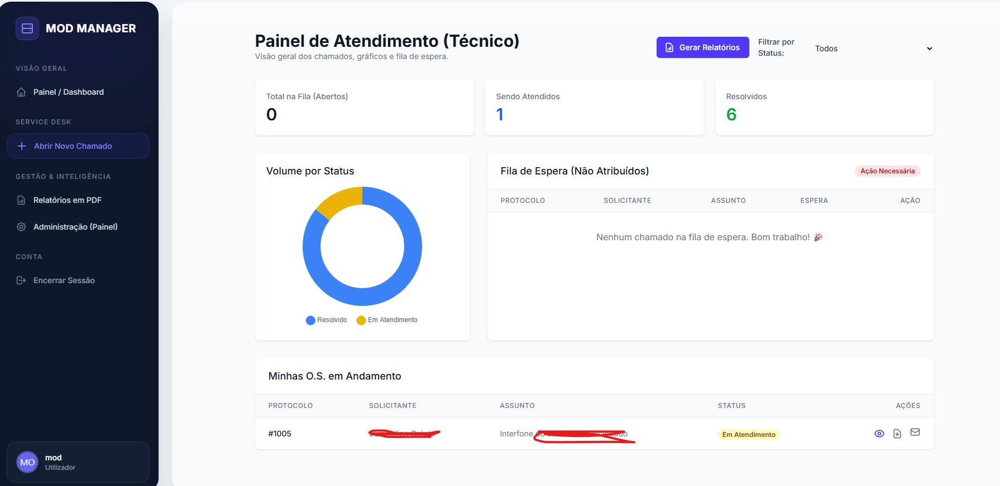

# Sistema de Gestão de TI e Helpdesk (Django)

Este projeto é um sistema web desenvolvido em Django para gestão completa de departamentos de TI, focado em ambientes multi-empresa (multi-tenant). O sistema integra controlo de acesso, inventário detalhado de hardware e gestão de chamados (Service Desk).



# Sistema de Gestão de TI e Helpdesk (Django)

✨ **[Clique aqui para ver a nossa Documentação Interativa e Roadmap Visual!](https://mod64bits.github.io/modos/)** ✨

Este projeto é um sistema web desenvolvido em Django...

### Ajustes e melhorias

O projeto ainda está em desenvolvimento e as próximas atualizações serão voltadas para as seguintes tarefas:

- [x] Painel do Utilizador
- [x] Painel do Administrador
- [x] Painel do Tecnico
- [x] Envio de e-mail
- [x] Filtro de Relatorios
- [x] Envio de relatórios em PDF por email
- [x] Orcamentos avulsos
- [x] Orcamentos para empresas cadastradas
- [x] Portal Público de Consulta de Orçamentos (Acesso via Link Seguro e Hash)
- [ ] Integração com sistemas externos (unifi)
- [ ] Integração com sistemas externos (Mikrotik)
- [ ] Integração de Meios de Pagamento (Futuro)

---

## 🚀 Funcionalidades Principais

### 1. Gestão Corporativa (App `accounts`)
* **Multi-tenant**: Estrutura preparada para gerir múltiplas empresas na mesma base de dados.
* **Hierarquia**: Empresa -> Setores -> Utilizadores.
* **Utilizadores Personalizados**: Login com vínculo obrigatório a uma Empresa e Setor.
* **Segurança**: Mixins de proteção para garantir que os utilizadores só vejam dados da sua própria empresa.

### 2. Inventário de Ativos (App `equipamentos`)
* **Herança de Modelos**:
  * `Equipamento` (Base): Serial, Marca, Modelo, Responsável.
  * `Computador` (Filho): Processador, RAM + Discos.
  * `Periferico` (Filho): Monitores, Teclados, Impressoras.
* **Gestão de Armazenamento**: Vínculo *One-to-Many* para múltiplos discos (SSD/HDD) por computador.
* **Rastreabilidade**: Periféricos podem ser vinculados ("plugados") a um computador específico ou ficarem livres no stock.

### 3. Service Desk / Chamados (App `orders` / `chamados`)
* **Tickets e O.S.**: Abertura de chamados para manutenção corretiva, preventiva ou requisições.
* **Sistema de Comentários**: Interação contínua entre utilizador e técnico na página de detalhes da O.S., com suporte a upload de anexos (imagens/documentos). O formulário é bloqueado automaticamente quando o chamado é encerrado.
* **Fluxo de Trabalho**:
  * Atribuição de técnicos (apenas utilizadores `Staff`).
  * Registo automático de transferência de técnicos (Auditoria).
  * Mudança automática de status (Aberto -> Em Atendimento).
  * Categorização por tipo de serviço (Hardware, Software, Rede).

### 4. Dashboards e Gráficos (App `dashboard`)
* **Painel do Utilizador**: Visão consolidada de chamados em aberto, andamento e histórico. Inclui cancelamento seguro via Modal (protegido por CSRF).
* **Painel do Administrador/Técnico**:
  * Fila de espera de chamados (Não Atribuídos).
  * Opção rápida para o técnico "Puxar O.S." para si.
  * Gráficos dinâmicos (via Chart.js) exibindo o volume de chamados por status.
  * Filtros em tempo real na listagem.

### 5. Configurações Globais e Notificações (App `core`)
* **Design Dinâmico (Singleton)**: Alteração do Título do Sistema, texto de Rodapé e URL Base do sistema diretamente pelo Django Admin, refletindo instantaneamente em todo o site.
* **Servidor de E-mail (SMTP) no Admin**: Backend de e-mail customizado que lê as configurações (Host, Porta, Utilizador, Password, TLS) diretamente da base de dados. Permite trocar a conta de disparo sem alterar o código-fonte ou reiniciar o servidor.
* **Notificações Automáticas**: Disparo de e-mails em tempo real (utilizando Django Signals) para alertar solicitantes e técnicos sempre que um chamado for aberto ou atualizado.

### 6. Gestão de Orçamentos e Vendas (App `orcamentos`)
* **Catálogo de Produtos:** Base de dados centralizada de equipamentos e serviços com gestão de custo base de compra.
* **Calculadora de Margens:** Cálculo automático de lucro, markup e valor de venda na adição de itens aos orçamentos.
* **Múltiplos Perfis de Cliente:** Suporte flexível tanto para empresas já registadas no sistema como para clientes avulsos.
* **Exportação Dinâmica em PDF:**
  * **Via Gerencial:** Relatório confidencial com exposição de custos e lucros (acesso restrito à equipa técnica).
  * **Via do Cliente:** Documento profissional otimizado para o cliente final, exibindo apenas os valores de venda.
* **Portal Público de Consulta:** Acesso independente sem necessidade de login, onde o cliente introduz o Número da O.S. e um Código de Acesso (Hash de 6 caracteres) para consultar a proposta em PDF. Inclui validação automática de data de expiração da proposta.

---

## 🛠️ Instalação e Configuração

### Pré-requisitos
* Python 3.8+
* Django 4.0+
* `django-localflavor` (Opcional, para validação de CNPJ)
* `django-tailwind` (Para a renderização do frontend)
* `xhtml2pdf` (Para geração de relatórios e orçamentos em PDF)

### Passo a Passo

1. **Clonar e Instalar Dependências**
   ```bash
   pip install django django-stubs django-tailwind xhtml2pdf celery redis
   ```

2. **Configuração Inicial**
   No ficheiro `settings.py`, certifique-se de definir o modelo de utilizador personalizado e as permissões de CSRF para o seu domínio (se estiver em produção):
   ```python
   AUTH_USER_MODEL = 'accounts.Usuario'
   CSRF_TRUSTED_ORIGINS = ['[https://seusite.com](https://seusite.com)']
   ```

3. **Base de Dados e Configurações Core**
   ```bash
   python manage.py makemigrations accounts equipamentos orders core dashboard orcamentos
   python manage.py migrate
   ```

4. **Criar Superutilizador**
   ```bash
   python manage.py createsuperuser
   ```

5. **Correr o Servidor e Tailwind**
   Num terminal, inicie o servidor Django:
   ```bash
   python manage.py runserver
   ```
   
   Noutro terminal, inicie o compilador do Tailwind:
   ```bash
   python manage.py tailwind start
   ```
